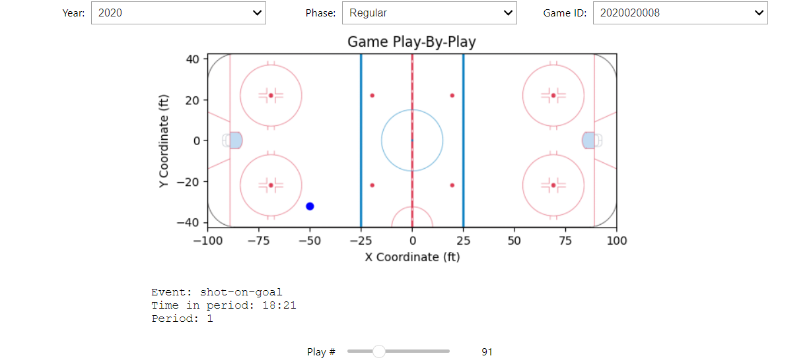

L'outil de débogage interactif permet de visualiser les événements qui se passent lors d'un jeu. Cet outil permet de sélectionner l'année, la phase de la saison, et le game ID avec des drop downs, ansi qu'un slider qui permet de sélectionner l'événement spécifique.



## Code

Le code a été écrit sur plusieurs cellule dans un jupyter notebook (Projet/ift6758/Widgets/interactive_debug_tool.ipynb). Chaque bloque de code correspond à une cellule.

```python
import ipywidgets as widgets
import json
import matplotlib.image as img
import matplotlib.pyplot as plt
import os
import pandas as pd

from IPython.display import clear_output
```

```python
def update_gameIds(year, season, id_dropdown):
    season_file_name = str(season)
    if season == "Regular":
        season_file_name = "season"
  
    game_path = f"../data/{year}/{season_file_name}.json"
    if os.path.exists(game_path):
        with open(game_path) as file:
            data = json.load(file)
    else:
        print(f"update_gameIds - Path not found:{os.path.abspath(game_path)}")

    gameIds = []
    for game in data:
        gameIds.append(game['id'])

    id_dropdown.options = gameIds
    id_dropdown.value = gameIds[0]
```

```python
years = [str(year) for year in range(2016, 2024)]

year_dropdown = widgets.Dropdown(
    options = years,
    value = years[0],
    description = "Year: "
)

seasons = ["Regular", "Playoffs"]
season_dropdown = widgets.Dropdown(
    options = seasons,
    value = seasons[0],
    description = "Phase: "
)

id_dropdown = widgets.Dropdown(
    description = "Game ID: "
)

update_gameIds(year_dropdown.value, season_dropdown.value, id_dropdown)

game_selector = widgets.HBox(
    [year_dropdown, season_dropdown, id_dropdown],
    layout=widgets.Layout(
        justify_content='center', 
        align_items='center'
    ))
```

```python
def load_game_info(year, season, game_id):
    season_file_name = str(season)
    if season == "Regular":
        season_file_name = "season"
  
    game_path = f"../data/{year}/{season_file_name}.json"
    if os.path.exists(game_path):
        with open(game_path) as file:
            data = json.load(file)
    else:
        print(f"load_game_info - Path not found:{os.path.abspath(game_path)}")
        return None

    season_df = pd.DataFrame(data)

    game_mask = season_df['id'] == game_id
    game = season_df[game_mask]

    if 'plays' not in game.columns:
        print("load_game_info - 'plays' key does not exist.")
        return None

    if len(game['plays']) != 1:
        print("load_game_info - len(game['plays']) != 1")
        return None
  
    if not isinstance(game['plays'], pd.Series):
        print(f"load_game_info - game['plays'] type is unrecognized - {type(game['plays'])}")
        return None
  
    plays = game['plays'].iloc[0]
    plays_info = []
    for play in plays:
        details = play.get('details', {})
        periodDescriptor = play.get('periodDescriptor', {})
        row = {
            'typeDescKey': play.get('typeDescKey'),
            'timeInPeriod': play.get('timeInPeriod'),
            'timeRemaining': play.get('timeRemaining'),
            'xCoord': details.get('xCoord'),
            'yCoord': details.get('yCoord'),
            'period': periodDescriptor.get('number')
        }
        plays_info.append(row)

    return pd.DataFrame(plays_info)
```

```python
df = load_game_info(year_dropdown.value, season_dropdown.value, id_dropdown.value)

# Initialize the widgets
plot_widget = widgets.Output()
slider_widget = widgets.IntSlider(value=0, min=0, max=df.shape[0]-1, step=1, description='Play #')
combined_widget = widgets.VBox(
    [game_selector, plot_widget, slider_widget],
    layout=widgets.Layout(
        justify_content='center', 
        align_items='center'
    ))
```

```python
def init_plot(ax):
    with plot_widget:
        x_min = -100
        x_max = 100
        y_min = -42.5
        y_max = 42.5
        rink_img = img.imread("../../figures/nhl_rink.png")

        ax.set_xlim(x_min, x_max)
        ax.set_ylim(y_min, y_max)
      
        ax.imshow(rink_img, extent=(x_min, x_max, y_min, y_max))

        ax.set_xlabel('X Coordinate (ft)')
        ax.set_ylabel('Y Coordinate (ft)')

def plot_play(play_number):
    with plot_widget:
        global df
        clear_output(wait=True)
        fig, ax = plt.subplots()
      
        init_plot(ax)
        play = df.iloc[play_number]
      
        ax.set_title(f"Game Play-By-Play")
        x = play['xCoord']
        y = play['yCoord']

        if pd.notna(x) and pd.notna(y):
            ax.plot(x, y, 'bo')

        plt.show()
        print(f"Event: {play['typeDescKey']}")
        print(f"Time in period: {play['timeInPeriod']}")
        print(f"Period: {play['period']}")

def on_id_change(year, season, game_id):
    global df 
    global slider_widget

    df = load_game_info(year, season, game_id)
    slider_widget.value = 0
    slider_widget.max = df.shape[0]-1
```

```python
slider_widget.observe(lambda change: 
                      plot_play(change['new']), 
                      names='value')
year_dropdown.observe(lambda change: 
                      update_gameIds(change['new'], season_dropdown.value, id_dropdown), 
                      names='value')
season_dropdown.observe(lambda change: 
                        update_gameIds(year_dropdown.value, change['new'], id_dropdown), 
                        names='value')
id_dropdown.observe(lambda change: 
                    on_id_change(year_dropdown.value, season_dropdown.value, change['new']), 
                    names='value')

display(combined_widget)
plot_play(slider_widget.value)
```
