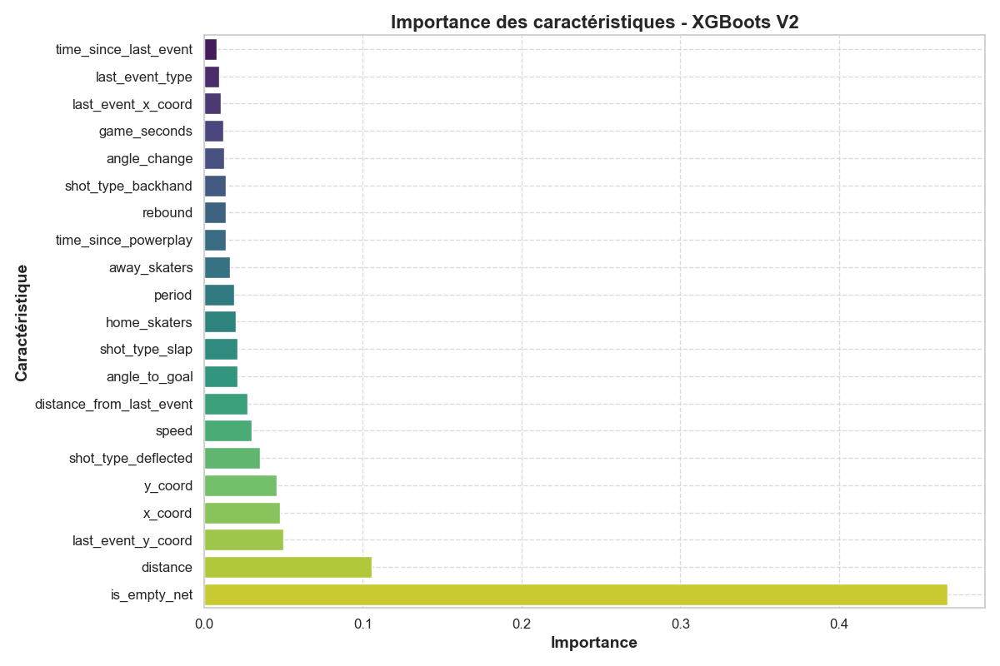
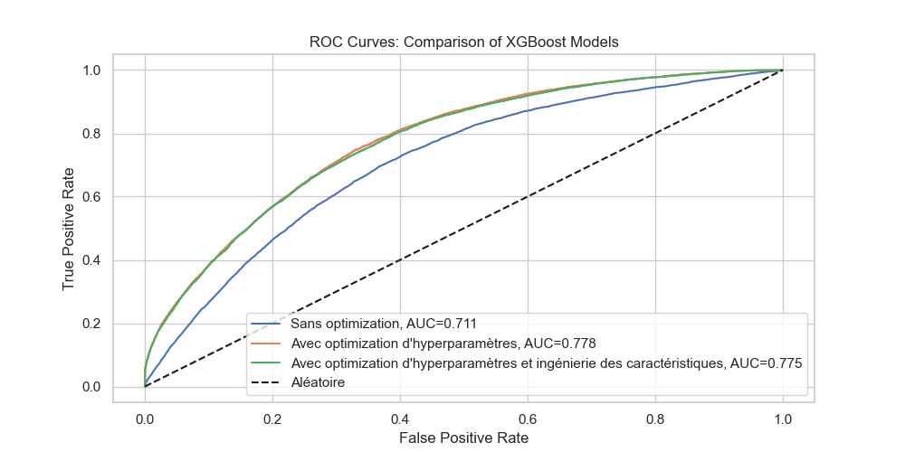
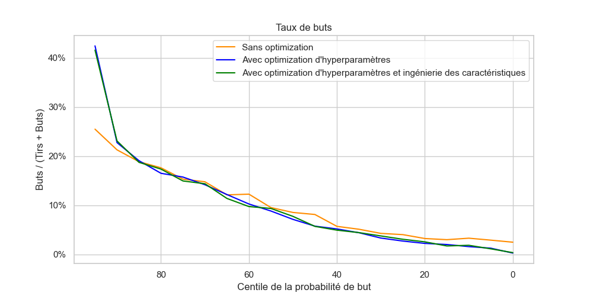
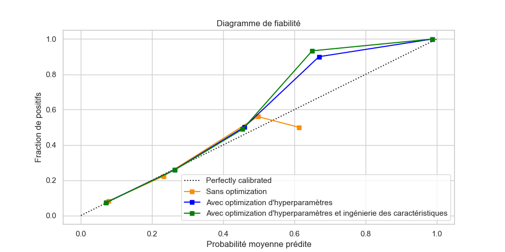

Dans cette étape du projet, XGBClassifier a été utilisé pour prédire la probabilité de but dans les matchs de la LNH, en fonction de plusieurs caractéristiques des tirs. Cette approche vise à évaluer les performances du modèle dans un contexte de prédiction probabiliste, donc la prédiction correcte de catégorie n'est pas une priorité.

Les métriques de performance utilisées sont l'accuracy et le ROC AUC. L'accuracy est utile pour évaluer la proportion de prédictions correctes, tandis que le ROC AUC est plus adapté aux prédictions probabilistes.

Plusieurs modèles ont été testés, entre autres, un modèle sans optimisation, un modèle avec optimisation d'hyperparamètres et un modèle avec pré-traitement de données et optimisation d'hyperparamètres.

## XGBoost sans optimisation

### Pré-traitement des données

Pour le premier modèle, les données ont été filtrées pour seulement considérer la distance du but et l'angle au but, et la division a été faite en 70% pour l'entraînement et 30% pour la validation, afin de pouvoir se comparer de façon juste aux modèles de bases précédemment entraînés.

### Optimisation d'hyperpamètres

Aucun ajustements des hyperparamètres n'ont été faits. Ils seront modifiés dans les modèles futurs.

### Résultats

Le modèle montre une accuracy de 0.90126: une haute proportion de prédictions correctes. Par contre, avec beaucoup plus de tirs sans but que de tirs avec but, cette métrique est probablement biaisée - le modèle excelle sur les non-buts mais performe moins bien sur les buts. Le ROC AUC de 0.71096 semble valider ce déséquilibre.

## XGBoost avec optimisation d'hyperparamètres

### Pré-traitement des données

Cette fois, toutes les données ont été considérées dans les données d'entraînement. Encore, 70% des données ont été utilisées pour l'entraînement et 30% pour la validation. De plus, afin de compatibiliser les données avec XGBoost, les shots types on été encodés en vecteurs one-hot.

### Optimisation d'hyperparamètres

Pour le modèle suivant, le focus était sur l'optimisation des hyperparamètres. L'optimisation bayésienne avec le log loss comme métrique d'évaluation et le negative log loss comme score ont été sélectionné pour l'optimisation. Le log loss est adapté pour ce type d'application, car il impose une punition lorsque les prédictions sont confiantes mais incorrectes. Le negative log loss a été sélectionné en combinaison avec le log loss pour le scoring puisque c'est le choix approprié.

L'optimisation bayésienne a été faite sur **50 essais**, à la fin desquels le score de negative log loss avait pratiquement convergé vers **-0,266**. Cette méthode a été préférée au grid search, qui était la première méthode à venir en tête, parce qu'elle ne nécessite pas d'intuition préalable pour sélectionner les valeurs des hyperparamètres. À la place, l'optimisation bayésienne recherche par elle-même les hyperparamètres en se basant sur les performances des combinaisons précédentes et, dans ce cas, en maximisant le neg log loss pour converger vers la meilleur sélection d'hyperparamètres. De plus, cette méthode teste les hyperparamètres en parallèle tout en tenant compte de leur interaction, ce qui est essentiel pour garantir leur synergie dans un modèle complexe comme XGBoost.

Les hyperparamètres testés incluent  `n_estimators` , `max_depth` , `learning_rate`, `colsample_bytree`, `subsample` et `min_child_weight` pour les raison suivantes:

* `n_estimators` contrôle le nombre d'arbres dans le modèle.
* `max_depth` régule la profondeur des arbres, ce qui contrôle le sous-apprentissage vs. sur-apprentissage.
* `learning_rate` ajuste la vitesse de convergence.
* `colsample_bytree` et `subsample` gèrent respectivement la proportion de caractéristiques et d'échantillons utilisés pour construire chaque arbre, permettant les sous-arbres de se "spécialiser" dans un sens.
* `min_child_weight` impose une contrainte sur le poids minimal d'un nœud feuille, prévenant le sur-apprentissage.

### Résultats

Les résultats obtenus montrent une **accuracy de 0.9064** et un **ROC AUC de 0.7781**. Comparé au modèle précédent, ayant une accuracy de 0.9013 et un ROC AUC de 0.7110, ce modèle améliore légèrement l'accuracy et significativement le ROC AUC. Cette augmentation du ROC AUC indique que le modèle est beaucoup meilleur pour distinguer les tirs qui mènent à un but de ceux qui ne mènent pas à un but.

L'optimisation bayésienne à convergé sur un nombre d'estimateurs `n_estimators = 108`, d'une profondeur des arbres `max_depth = 7` et d'un taux d'apprentissage `learning_rate = 0.0729`. Les paramètres liés à la sélection des échantillons et des caractéristiques `colsample_bytree = 0.8135`, `subsample = 0.9101` favorisent la généralisation, tandis qu'un poids minimal des enfants de `min_child_weight = 2` réduit limite la complexité des arbres.

## XGBoost avec ingénierie des caractéristiques et optimization d'hyperparamètres

### Pré-traitement des données

Toutes les caractéristiques numériques ont été mises à l'échelle à l'aide d'un Standard Scaler, ce qui centre les données autour de 0 et les normalise à une variance de 1. Cela permet de ramener toutes les caractéristiques sur la même échelle et évite que les caractéristiques avec des plages de valeurs élevées dominent celles avec des plages plus petites, améliorant ainsi la convergence et la stabilité de l'entraînement.

#### Sélection des caractéristiques

L'algorithme Select K Best a été utilisé pour filtrer les caractéristiques afin de réduire la complexité du modèle, d'empêcher le sur-apprentissage sur l'ensemble d'entraîenement et d'améliorer la généralisabilité du modèle.

En regardant la matrice de correlation, nous voyons que les caractéristiques `shot_type_snap`, `shot_type_tip-in`, `shot_type_wrap-around` et `shot_type_wrist` ont une corrélation proche de zéro avec  `is_goal`. Ce n'est donc pas surprennant que l'algorithme aie filtré ces caractéristiques.

#### Importance des caractéristiques

Dans graphique ci-dessus, nous voyons que `is_empty_net` est de loin la variable la plus influente. C'est tout-à-fait logique - marquer un but est beaucoup plus facile s'il n'y a pas de guardient! Les deux autres caractéristiques importantes sont `distance`, qui mesure la proximité du tir par rapport au but, et `last_event_y`, ce qui est un peu cryptique et qui démontre un des avantages de l'IA - il permet de remarquer des correlations qui nous ne sont pas toujours évidents ou facilement interpretable.

### Optimisation d'hyperparamètres

Les hyperparamètres utilisés pour ce modèles sont les même que les hyperparamètres optimisés du modèle précédent.

### Résultats

Les résultats du modèle avec pré-traitement montrent une légère amélioration de l'accuracy (0.9066 contre 0.9064), mais une petite baisse du ROC AUC (0.7752 contre 0.7781). Cette baisse est surprennante et pourrait indiquer que le pré-traitement des données pourrait être améliorer. Cependant, cela pourrait aussi être un symptôme d'un modèle qui est simplement moins sur-entraîné sur l'ensemble d'entraînement et qui performera mieux sur des données inconnues.

## Comparaison des modèles

### Courbes ROC

Ce graphique permet de comparer la proportion de classifications de buts juste (True Positive Rate) comparé à la proportion de classification de buts mais qui ne sont pas observées (False Positive Rate). En baissant le seuil de décision, le true positive rate augmente parce plus de tirs sont considérés, mais le false positive rate peux également augmenté parce que plus de tirs sont faussement considérés comme buts.

Un graphique idéal passe par un true positive rate de 100% et un false positive rate de 0% - cela décrit un classifieur idéal avec un seuil optimal. Donc, un graphique qui se rapproche plus de cette forme crochetée indique un modèle qui prédit mieux. En regardant les courbes, nous voyons que les modèles avec optimisation d'hyperparamètres sont indistinguables les un des autres, mais sont facilement supérieur au modèle sans optimisation. Cela est refleté dans leur score ROC AUC, qui représente l'aire en-dessous de la courbe ROC.

### Pourcentage de buts cumulés

Nous voyons dans ce graphique que pour les modèles optimisés, la pente initial est plus aïgue. En particulier, au-delà du 90e percentile, nous voyons une pente plus prononcée qui s'applatit tranquillement en descendant les centiles. Cela indique que les modèles avancés ont un taux de prédiction de but supérieur. Cependant, il n'est pas possible de distinguer à l'oeil une différence entre les modèles optimisés avec et sans pré-traitement de données

### Taux de buts

Le graphique de taux de but nous aide à interpreter la fiabilité de prédiction d'un modèle. Avec un modèle ayant une bonne performance, nous nous attendons à ce qu'aux alentours des percentiles élevés de probabilité de but qu'une majorité des buts soient prédits. En descendant les percentiles de probabilité prédite de buts, nous nous attendons à retrouver moins de buts. Avec un modèle nul, nous nous attendrons à avoir une ligne plate indiquant que la prédiction du modèle ait aucun lien à la proportion de buts.

Dans le graphique, nous voyons que les modèles optimisés, encore une fois, sont indistinguables les uns des autres, mais démontrent une bien meilleur performance que le modèle non-optimisé - une plus grande proption de but existe dans les centiles élevés des modèles optimisé indiquant que leur prédictions sont plus précises.

### Diagramme de fiabilité

Le diagramme de fiabilité permet de comparer la probabilité moyenne prédite par le modèle à la fraction de buts. Dans un classifieur idéal, on s'attendrait que pour tous les buts ayant été prédits avec 20% de chance ou moins d'avoir une fraction de buts de 20% dans ce sous-ensemble. Dans le fond, on s'attendrait à une droite parfaite - comme l'est illustré dans le graphique.

Dans nos courbes, comme d'habitude, nous voyons que les modèles optimisés se ressemblent énormément mais se différencie du modèle non-optimisé. Nous voyons que jusqu'à environ 50% de probabilité moyenne prédite, les classifieurs sont assez proche de la ligne optimal. Par la suite, les modèles optimisés prédictent avec trop de confiance - à environ 70% de probabilité moyenne prédite nous avons environ 85% de fraction de positifs. Il est intéressant à noter que le modèle avec le prétraitement de données est encore plus sur-confiant que le modèle sans le pré-traitement. Cette sur-confiance dans les intervales mi-hautes et suivie d'une sous-confiance dans les intervalles très hautes (90% et plus).
