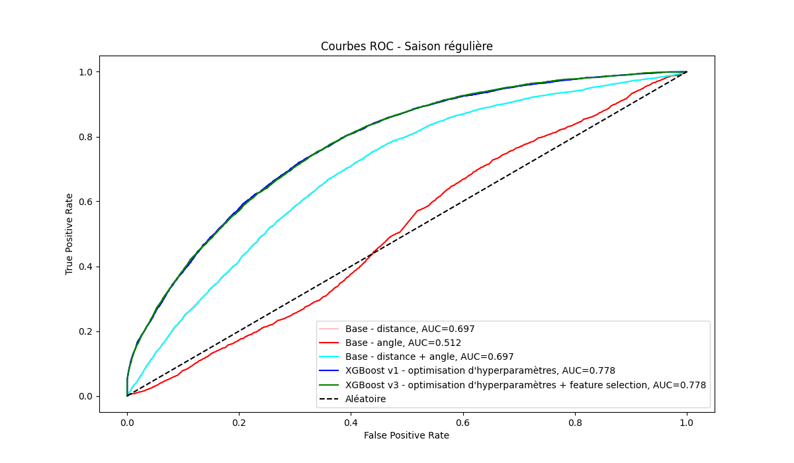
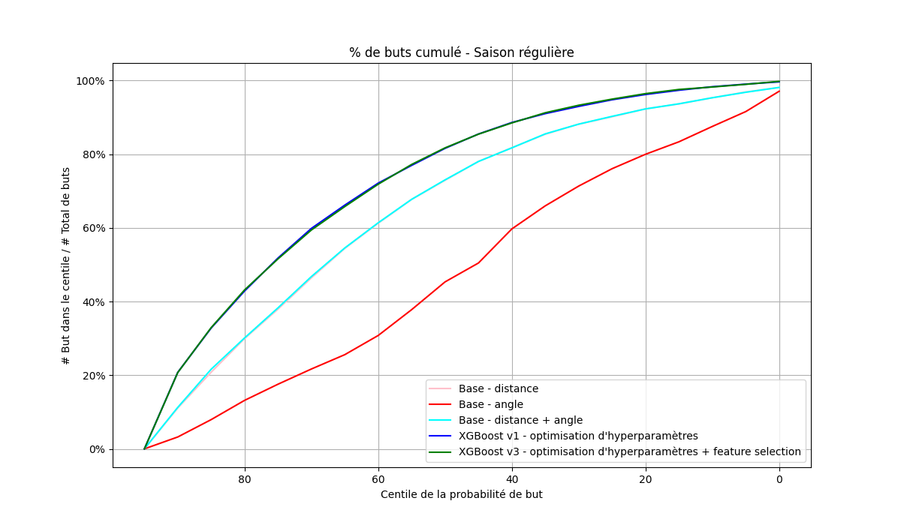
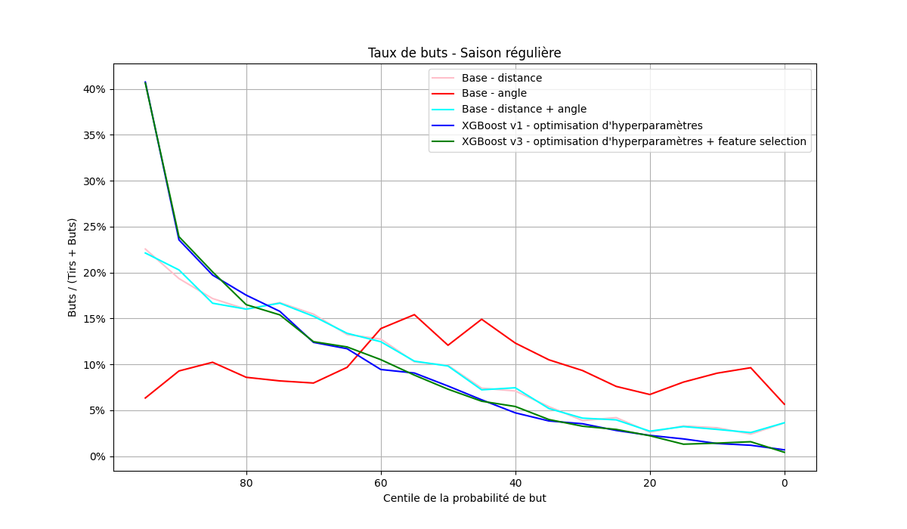
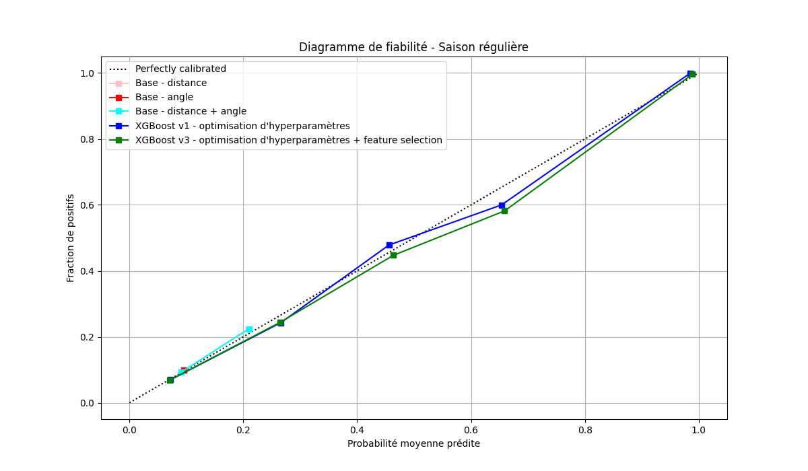
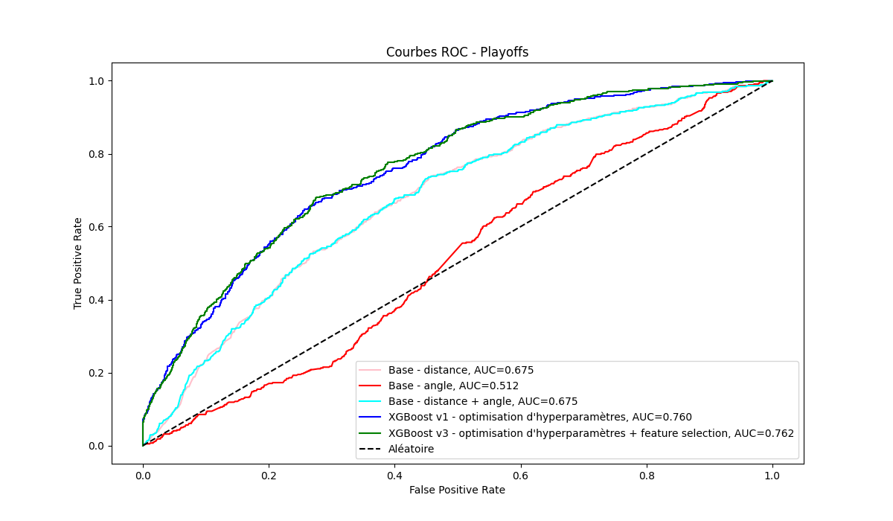
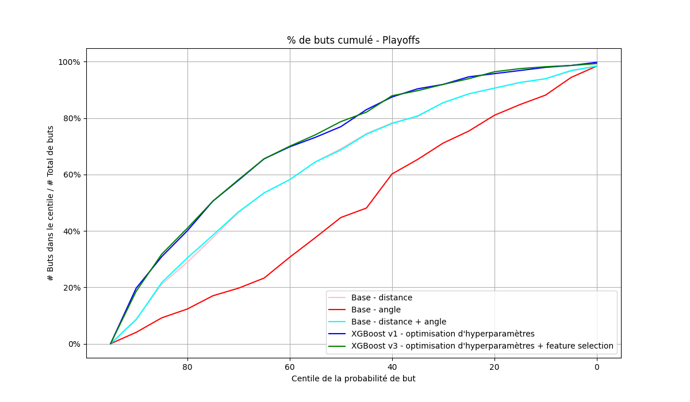
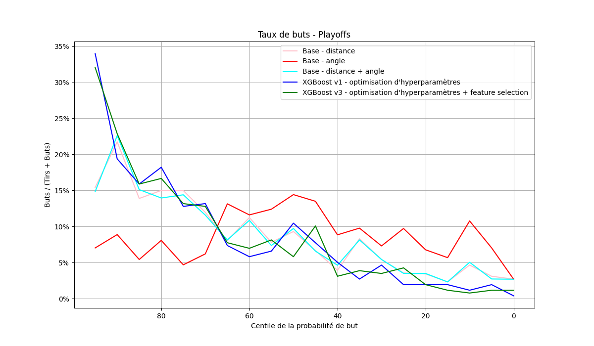
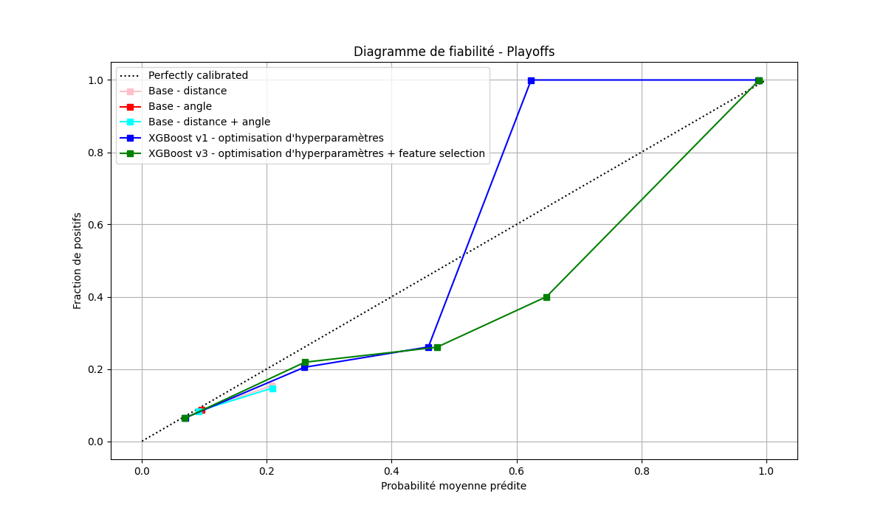

## Saison régulière

Tous les modèles ont été entraînés sur tous les tirs des saisons régulières de 2016 à 2019 inclusivement.

Dans cette section, nous avons fait des prédictions sur la saison régulière de 2020 et avons produits plusieurs graphiques. Nous avons testé les modèles suivants:

- Un modèle de base (régression logistique) entraîné uniquement sur la distance
- Un modèle de base entraîné uniquement sur l'angle
- Un modèle de base entraîné sur l'angle et la distance
- Un modèle XGBoost entraîné sur toutes les données avec optimisation d'hyperparamètres
- Un modèle XGBoost entraîné sur toutes les données avec feature engineering et optimisation d'hyperparamètres.

Ces derniers seront étiquettés sur les graphiques pour contribuer à la lisibilité.

Les graphiques que nous analyseront seront les graphiques ROC, de pourcentage de buts cumulés, de taux de buts, et fiabilité.

### ROC

En observant le graphique ci-dessus nous voyons que les courbes se distingue générallement bien les unes des autres, mis à part les deux courbes Base - distance et Base - distance + angle, ansi que les deux courbes de XGBoost qui sont essentiellement identiques.

#### Modèle entraîné sur l'angle

La ligne Base - angle démontre une forme assez similaire à la ligne aléatoire, avec bruit rajouté. De plus, l'aire en-dessous de la courbe à une valeure de 0.512, presequ'indentique à l'aire d'une courbe parfaitement aléatoire de 0.5. Donc, nous pouvons en conclure que l'angle n'a probablement très peu d'impact sur la probabilité de but.

#### Modèles entraînés sur la distance

En remontant les courbes, nous retrouvons les courbes Base - distance et Base - distance + angle. Nous avons observé que l'angle ne semble jouer aucun rôle dans la probabilité de but d'un tir. Cela est également justifié par le fait que la courbe de distance + angle n'a aucune différence avec la courbe de distance. Alors, nous voyons qu'avec des scores ROC AUC de 0.697, la distance joue un rôle significatif dans la prédiction de probabilité de but d'un tir. Que la distance dans un régresseur logistique donne un résultat respectable, mais encore une fois nous pouvons faire un peu mieux.

#### XGBoost

En remotant encore une fois, nous voyons les courbes de XGBoost. Ces courbes sont autant identiques que les dernières - elles ont également un score ROC AUC identiques lorsqu'arrondit à 3 chiffres significatifs, soit de 0.778, un score assez respectable.

D'après cette courbe, nous voyons très clairement que les modèles XGBoost démontrent le meilleur compromis entre le taux de vrai positifs et le taux de faux négatifs. En manipulant le seuil de classification de ces derniers, nous nous retrouverons généralement avec le meilleur compromis entre taux de buts bien classifiés et taux de buts mal classifiés.

### Pourcentage de buts cumulés

Le graphique ci-dessus est remarquablement similaire au dernier. Encore une fois, nous voyons que le modèle Base - angle forme presqu'une droite, que les modèles de base incluant la distance sont identiques et que les modèles de XGBost le sont aussi.

#### Modèle entraîné sur l'angle

Pour en revenir à la ligne d'angle - nous voyons un comportement similaire au dernier graphique. En descendant les percentiles, le pourcentage de buts cumulés monte linéairement. Cela supporte encore notre hypothèse que l'angle n'a aucun impacte sur la probabilité de but et donc les centiles de probabilité avec ce modèle prédisent essentiellement aléatoirement si ça sera un but ou pas, ce qui explique la droite.

#### Modèles entraînés sur la distance

Encore, nous voyons que les modèles incluant la distance performe relativement bien, surtout en comparaison avec l'angle. Ils prédisent beaucoup de buts dans les haut percentiles, voulant dire que les prédictions ayant une probabilité plus forte prédisent effectivement plus de but. En descendant les percentiles, nous pouvons déterminer visuellement que le dérivé du graphique descent, indiquant qu'avec des probabilité plus basses, moins de buts se cumulent. C'est le résultat attendu d'un bon modèle.

#### Modèles XGBoost

Cependant, les modèles XGBoost performe encore mieux. En regardant les graphiques, nous voyons que la valeur du dérivé du graphique est le plus élevé en haut percentiles pour les modèles XGBoost. Cela indique qu'ils cumulent rapidement des buts dans les hauts percentiles lorsque la probabilité de but prédite est élevée.

Au final, nous voyons encore que les modèles XGBoost performent les mieux et se rapprochent le plus du graphique idéal, soit une droite verticale à zéro sur l'axe des x qui remonte à 100% et une ligne horizontal à 100% sur l'axe des y (un crochet).

### Taux de buts

Dans ce graphique, nous pouvons un peu mieux distinguer les lignes différentes, mais nous observons encore la même tendance - la ligne d'angle semble aléatoire, les lignes de modèles entraînés sur la distance performent relativement bien et sont très collés, et les modèles XGBoost performent les mieux et sont aussi très collés.

#### Modèle entraîné sur l'angle

Nous voyons que la courbe du modèle Base - angle est un peu bruité, mais en générale, si nous dessinions une ligne de tendance au travers, nous verrons que peu importe le centile, le taux de buts reste relativement constant au alentours de 10%. Cela est indicatif d'un modèle qui fait des prédictions qui ne sont pas corrélées à la vrai probabilité de but.

#### Modèles entraînés sur la distance

Les modèles entraînés sur la distance présentent encore des courbes très similaires. Elles démontrent un taux de but relativement grand qui se fait prédire dans les haut percentiles et qui descend apiquement au début, mais tranquillement vers la fin. Cela est indicatifs de modèles qui font des prédictions de probabilité réellement corrélées à la vrai probabilité.

#### Modèles XGBoost

Les modèles XGBoost ont les meilleurs courbes de tous les modèles. Ils ont la pente la plus apique dans les hauts percentiles indiquant qu'ils prédisent bien les buts lorsque leur probabilité prédite est élevée.

### Diagramme de fiabilité

#### Modèle entraîné sur l'angle

Nous voyons que ce modèle ne fait pas de prédictions dépassant environ 7% de probabilité. Cela n'est pas surprennant considérant les dernières analyses.

#### Modèles entraînés sur la distance

Nous voyons que ces modèles ne font pas de prédictions de probabilité élevées non plus - pas plus que 20%. Cela explique pourquoi aucun des tirs est prédit comme étant un but - aucuns pourcentages ne dépassent le seuil de 50%.

#### Modèles XGBoost

En général, nous voyons que les modèles XGBoost font des prédictions qui sont plutôt fiables sur cet ensemble de données. Leurs courbes collent de près la courbe idéale. Nous voyons, par contre, une touche de sous-confiance entre environ 50% et 65% de probabilité moyenne prédite suivit d'une faible sur-confiance compensatrice vers la fin des courbes. Cette tendance est un peu plus prononcée dans le modèle sans feature engineering.

## Playoffs

Maintenant, nous regarderons la performance des modèles sur les tirs des playoffs de 2020. Le but de cette section sera moins de comparer la performance des modèles, mais plutôt de comparer la performance sur ce jeu de donnée spécifiquement.

Les playoffs sont considérés un environement de jeu plus intense - les enjeux sont plus élevés. En conséquent, le comportement des joueurs risque de différer de leur comportement dans la saison régulière. Autrement dit, il y a un risque que les tirs de playoffs fassent partie d'une distribution différente que les tirs de saison régulière.

Nous verrons donc comment nos modèles performent sur ces nouvelles données.

### ROC

Nous observons que la tendance générale est la même qu'avec la saison régulière. Cependant, les performances ont un peu diminué - d'environ 0.18 pour les modèles XGBoost et aussi pour les modèles entraînés sur la distance. Le modèle entraîné sur l'angle demeure exactement autant aléatoire qu'avant. Cette baisse de performance suggère du overfitting sur les données de saison régulière. Il reste à préciser que la performance du modèle avec feature engineering n'a pas autant baissé - ce qui suggère que le feature engineering a permis de mieux généraliser les prédictions sur ce jeu de données.

### Pourcentage de buts cumulés

En comparaison avec le graphique pour la saison régulière, il n'y a pas de différence significative. La seule différence est que le modèle XGBoost avec feature engineering semble performer un tout petit peu mieux que sans feature engineering.

### Taux de buts

Encore, la tendance générale est la même qu'avec la saison régulière, mais avec des performances moins bonnes. Nous voyons dans l'autre graphique que les taux de buts commençait au-delà de 40% pour les modèles XGBoost, ce qui est réduit à en dessous de 35% dans ce cas. Cela indique que moins de but sont prédits correctement dans les pourcentages plus élevés de probabilité prédite pour la saison playoffs que la saison régulière.

### Diagramme de fiabilité

Ici, nous voyons vraiment une grande différence entre le graphique de playoffs et le graphique de saison régulière. Dans cas-ci, nous voyons que tous les modèles sont moins fiable et nous voyons aussi une divergeance dans la fiabilité des modèles XGBoost. Entre autre, le modèle XGBoost sans feature engineering est très sur-confiant des prédictions entre environ 40% et 60% de probabilité moyenne prédite et compense en étant complètement sous-confiant par la suite parce que tous les positifs on déjà été prédits. En contraste, le modèle XGBoost avec feature engineering semble bénéficier d'une meilleur fiabilité - il est sous confiant lorsque la probabilité moyenne prédite est faible, mais reprend de la confiance dans ses prédictions par la suite.

## Conclusion

En résumé, nous voyons que les modèles XGBoost performent nettement mieux dans toutes les métriques analysées que les modèles de base, autant dans la saison régulière que dans les playoffs, mais particulièrement mieux dans les playoffs pour le modèle avec feature engineering.

D'après les analyses précédentes, nous avons observé que:

- L'angle ne semble pas avoir d'impacte sur la probabilité qu'un tir soit un but
- Les modèles XGBoost différencient mieux les buts des tirs non réussis, avec une performance AUC de 0.778 sur la saison régulière
- Les performances des modèles sur les playoffs sont moins bonnes
- Les modèles sont overfitté sur les données de la saison régulière
- Le feature engineering a aidé à mitigé ce overfitting

En conclusion, XGBoost avec feature engineering et optimisation d'hyperparamètres est le modèle de prédiction le plus robuste dans ce contexte. Cependant, les écarts de performance entre la saison régulière et les séries éliminatoires démontrent le besoin de mieux ajuster les modèles pour tenir compte des variations dans la distribution des tirs. Cela ouvre des pistes pour de futures améliorations, telles que l'incorporation de données des playoffs dans l'entraînement.
